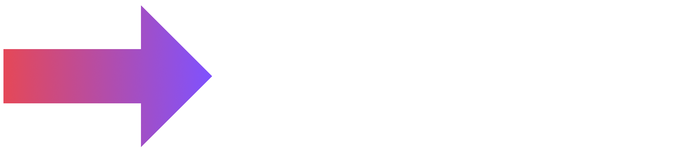

<picture>
  <source media="(prefers-color-scheme: dark)" srcset="readmeFiles/KYS2Dark.png">
  <source media="(prefers-color-scheme: light)" srcset="readmeFiles/KYS2.png">
  
</picture>

# KYS
KYS (or somtimes kShell) is a simple shell similar to bash written in Kotlin.

## Why?
Autism. And also I want to learn Kotlin.
This is a pain to make, but there's no better way to grow as a person than to do everything you hate.
 
I tried to make it without much help, but I used AI for a few things. Mostly just reading from the PATH.
